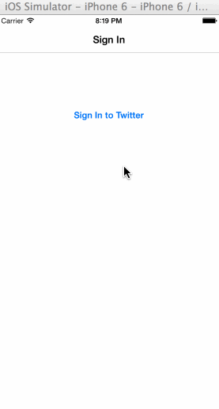

# Twitter Client, the First

This is a simple demo Twitter client.

**Time spent:** 13 hours

## Completed User Stories

* [x] User can sign in using OAuth login flow
* [x] User can view last 20 tweets from their home timeline
* [x] The current signed in user will be persisted across restarts
* [x] In the home timeline, user can view tweet with the user's: 
    * profile picture
    * username
    * tweet text
    * timestamp
* [x] User can pull to refresh
* [x] User can compose a new tweet by tapping on a compose button.
* [x] User can tap on a tweet to view it, with controls to...
    * [x] retweet
    * [x] favorite
    * [x] reply
* [x] Optional: When composing, you should have a countdown in the upper right for the tweet limit.
* [x] Optional: After creating a new tweet, a user should be able to view it in the timeline immediately without refetching the timeline from the network.
* [x] Optional: Retweeting and favoriting should increment the retweet and favorite count.
* [ ] Optional: User should be able to unretweet and unfavorite and should decrement the retweet and favorite count.
* [x] Optional: Replies should be prefixed with the username and the reply_id should be set when posting the tweet,
* [ ] Optional: User can load more tweets once they reach the bottom of the feed using infinite loading similar to the actual Twitter client.

## Notes

* pull-to-refresh does an incremental load (uses `since_id`)
* when going back from a tweet detail, the scroll of the home page table is messed up
* in compose view, changes to the countdown are animated (wanted to turn this off but didn't attempt)

## Walkthrough of All User Stories

GIF created with [LiceCap](http://www.cockos.com/licecap/).

## Attributions

* Retweet by im icons from The Noun Project
* Star by Edward Boatman from The Noun Project

