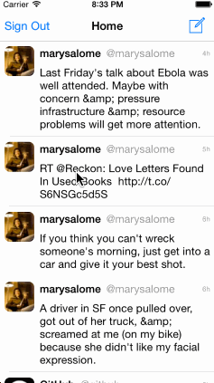

# Twitter Client, the Second

This is a simple demo Twitter client.

**Time spent:** 13 hours

## Completed User Stories

* [x] Hamburger menu
    * [x] Dragging anywhere in the view should reveal the menu.
    * [x] The menu should include links to
        * [x] your profile
        * [x] the home timeline
        * [x] the mentions view
    * The menu can look similar to the LinkedIn menu below or feel free to take liberty with the UI.
* [x] Profile page
    * [x] Contains the user header view
    * [x] Contains a section with the users basic stats: # tweets, # following, # followers
    * [ ] Optional: Implement the paging view for the user description.
    * [ ] Optional: As the paging view moves, increase the opacity of the background screen. See the actual Twitter app for this effect
    * [ ] Optional: Pulling down the profile page should blur and resize the header image.
* [x] Home Timeline
    * [x] Tapping on a user image should bring up that user's profile page
* [ ] Optional: Account switching
    * [ ] Long press on tab bar to bring up Account view with animation
    * [ ] Tap account to switch to
    * [ ] Include a plus button to Add an Account
    * [ ] Swipe to delete an account

## Notes

* burned a lot of hours on wrong approach to hamburger menu

## Walkthrough of All User Stories

GIF created with [LiceCap](http://www.cockos.com/licecap/).

## Attributions

* Retweet by im icons from The Noun Project
* Star by Edward Boatman from The Noun Project

